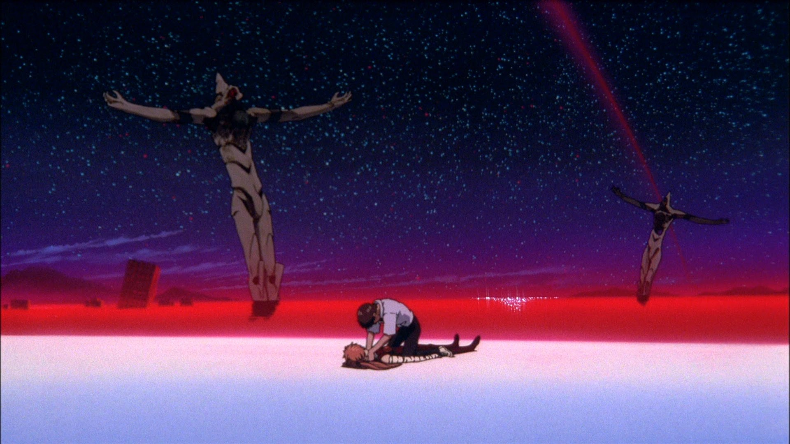

    

 

  

<h2>Study</h2>

<h2>Interests</h2>

 

 

<h2>Core stacks</h2>

 

    
<h2>Contribution graph</h2>

<picture>
  <source media="(prefers-color-scheme: dark)" srcset="https://raw.githubusercontent.com/axioncs/axioncs/output/breakout-contribution-graph-dark.svg">
  <source media="(prefers-color-scheme: light)" srcset="https://raw.githubusercontent.com/axioncs/axioncs/output/breakout-contribution-graph.svg">
  
</picture>

  

